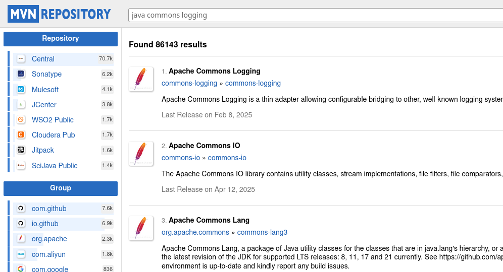

# LAb 4-3: Dependencies and Plugins

## Lab Setup

- Start with the final version of lab 4-2

## Part 1: Adding Logging

- To illustrate Maven's dependency management, you will add logging capabilities to `App.java.`

### Step 1: Get the dependency

- The [Maven Repository Central](https://mvnrepository.com/repos/central) is where you can find most of the standard libraries


- Searching for `Java Commons Logging` produces this result




- Selecting the first one produces


- Choosing the most recent version takes us to a page where we can copy the snippet we need for our pom.xml file
- The snippet is in the `logging.xml` file in the Assets directory


- Add this dependency to the pom.xml file right after the JUnit dependency like this

```xml
<project xmlns="http://maven.apache.org/POM/4.0.0" xmlns:xsi="http://www.w3.org/2001/XMLSchema-instance"
  xsi:schemaLocation="http://maven.apache.org/POM/4.0.0 http://maven.apache.org/maven-v4_0_0.xsd">
  <modelVersion>4.0.0</modelVersion>
  <groupId>exgnosis</groupId>
  <artifactId>HelloWorld</artifactId>
  <packaging>jar</packaging>
  <version>1.0-SNAPSHOT</version>
  <name>HelloWorld</name>
  <url>http://maven.apache.org</url>
  <properties>
    <project.build.sourceEncoding>UTF-8</project.build.sourceEncoding>
    <maven.compiler.source>21</maven.compiler.source>
    <maven.compiler.target>21</maven.compiler.target>
</properties>
  <dependencies>
    <dependency>
      <groupId>junit</groupId>
      <artifactId>junit</artifactId>
      <version>3.8.1</version>
      <scope>test</scope>
    </dependency>
    <!-- https://mvnrepository.com/artifact/commons-logging/commons-logging -->
<dependency>
    <groupId>commons-logging</groupId>
    <artifactId>commons-logging</artifactId>
    <version>1.3.5</version>
</dependency>
  </dependencies>
</project>

```

- When you save the pom.xml file, VS Code may ask if you want to synchronize the project, if so, answer yes
- If you are not prompted, run `mvn validte`

- Confirm the dependency is there by running `mvn dependency:list`

- You should see something like this

```console
$ mvn dependency:list
[INFO] Scanning for projects...
[INFO] 
[INFO] ------------------------< exgnosis:HelloWorld >-------------------------
[INFO] Building HelloWorld 1.0-SNAPSHOT
[INFO]   from pom.xml
[INFO] --------------------------------[ jar ]---------------------------------
[INFO] 
[INFO] --- dependency:3.6.1:list (default-cli) @ HelloWorld ---
[INFO] 
[INFO] The following files have been resolved:
[INFO]    junit:junit:jar:3.8.1:test -- module junit (auto)
[INFO]    commons-logging:commons-logging:jar:1.3.5:compile -- module org.apache.commons.logging
[INFO] 
[INFO] ------------------------------------------------------------------------
[INFO] BUILD SUCCESS
[INFO] ------------------------------------------------------------------------
[INFO] Total time:  0.677 s
[INFO] Finished at: 2025-06-23T16:21:00-04:00
[INFO] ------------------------------------------------------------------------

```

### Step 2: Add the code

- In the `App.java` file, add the following Java code

```java
package exgnosis;

import org.apache.commons.logging.Log;
import org.apache.commons.logging.LogFactory;

/**
 * Hello world!
 *
 */
public class App 
{
    private static final Log logger = LogFactory.getLog(App.class);
    public static void main( String[] args )
    {
        logger.info("Starting HelloWorld application...");
        System.out.println("Hello, Maven!");
        logger.info("HelloWorld application finished.");
    }
}

```

- Run the code from VSCode as a Java App and you should see the following output

```console
Jun 23, 2025 4:27:37 P.M. exgnosis.App main
INFO: Starting HelloWorld application...
Hello, Maven!
Jun 23, 2025 4:27:37 P.M. exgnosis.App main
INFO: HelloWorld application finished.
```

## Part 2: Adding a plugin

- In the previous lab, the jar file was not executable
- To fix this, we will add a Maven plug-in called the `maven-shade-plugin` which produces what is called fat jar or uber-jar. 
- An uber-jar file that has all the dependencies packaged inside so it can run as a stand-alone application. 
- We can use this plugin to also tell Java where to find the main method.

- The following needs to be added to the pom.xml file
- The code is available in the file `shade.xml` in the Assets directory

```xml
<build>
    <plugins>
      <plugin>
        <groupId>org.apache.maven.plugins</groupId>
        <artifactId>maven-shade-plugin</artifactId>
        <version>3.4.1</version>
        <executions>
          <execution>
            <phase>package</phase>
            <goals>
              <goal>shade</goal>
            </goals>
            <configuration>
              <transformers>
                <transformer implementation="org.apache.maven.plugins.shade.resource.ManifestResourceTransformer">
                  <mainClass>exgnosis.App</mainClass>
                </transformer>
              </transformers>
            </configuration>
          </execution>
        </executions>
      </plugin>
    </plugins>
  </build>
```

- The complete pom.xml file is in the file `final.xml` in the Assets directory
- 
- Run `mvn package` and you should see something like at the end of the output

```console
[INFO] Replacing original artifact with shaded artifact.
[INFO] Replacing /home/rod/working/maven/HelloWorld/target/HelloWorld-1.0-SNAPSHOT.jar with /home/rod/working/maven/HelloWorld/target/HelloWorld-1.0-SNAPSHOT-shaded.jar
[INFO] ------------------------------------------------------------------------
[INFO] BUILD SUCCESS
[INFO] ------------------------------------------------------------------------
[INFO] Total time:  1.823 s
[INFO] Finished at: 2025-06-23T16:38:42-04:00
[INFO] ------------------------------------------------------------------------
rod@exgnosis:~/working/maven/HelloWorld$ ls target

```

- Compare the two jar files for size.
- Note the increased size of the shaded jar file

```console
ls -lh target/*jar
-rw-r--r--. 1 rod rod  74K Jun 23 16:38 target/HelloWorld-1.0-SNAPSHOT.jar
-rw-r--r--. 1 rod rod 2.4K Jun 23 16:38 target/original-HelloWorld-1.0-SNAPSHOT.jar
```

- Finally, execute the shaded jar file

```console
$ java -jar target/HelloWorld-1.0-SNAPSHOT.jar
Jun 23, 2025 4:39:36 P.M. exgnosis.App main
INFO: Starting HelloWorld application...
Hello, Maven!
Jun 23, 2025 4:39:36 P.M. exgnosis.App main
INFO: HelloWorld application finished.

```


## End Lab
