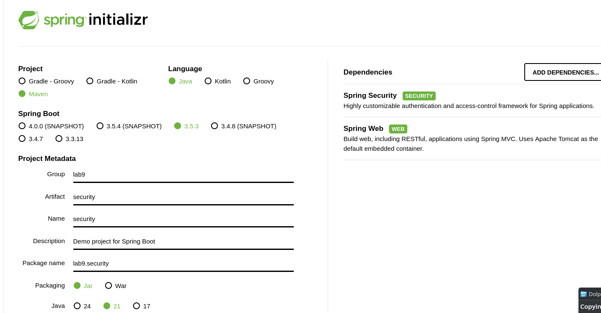

# Lab 9-1: Spring Security

## Lab Objective.

- In this lab, you will create a simple Web app with security

## Part 1: Define the project

- Just like you did for the MVC project, use start.spring.ip
- This time select both Spring Web and Spring Security
- The POM file generated for this writeup is in the Solutions directory



## Part 2: The RESTController

- Create the REST controller class as shown
- We want to have three endpoints
  - The `/public` endpoint doesn't require any security
  - The `/private` endpoint requires a login
  - The `/admin` endpoint produces a `403 access denied` error trying to access over the public Internet

```java
package lab9.security;


import org.springframework.web.bind.annotation.GetMapping;
import org.springframework.web.bind.annotation.RestController;

@RestController
public class Controller {

    @GetMapping("/public")
    public String publicEndpoint() {
        return "This is a public endpoint.";
    }

    @GetMapping("/private")
    public String privateEndpoint() {
        return "This is a private endpoint requiring authentication.";
    }

    @GetMapping("/admin")
    public String adminEndpoint() {
        return "This is an admin endpoint requiring ADMIN role.";
    }
}

```

## Part 3: Add the Security

- We add the SecurityConfig object.
- It allows free access to the `/public` endpoint
- But requires a user login for the `/private` endpoint
- And a login with a user with the `ADMIN` role for the `/admin` endpoint
- The code also creates to be used 

```java

@Configuration
@EnableWebSecurity
public class SecurityConfig {
    @Bean
    public SecurityFilterChain filterChain(HttpSecurity http) throws Exception {
        http
                .authorizeHttpRequests(authz -> authz
                        .requestMatchers("/public").permitAll() // Allow open access
                        .requestMatchers("/admin", "/admin/**").hasRole("ADMIN")
                        .anyRequest().authenticated() // Require authentication for all others
                )
                .formLogin(c -> {}) // Enable form-based login
                .httpBasic(c -> {}); // Enable HTTP Basic Auth


        return http.build();
    }

```

- Also add the code to create the users' info in memory into the class

```java
   @Bean
    public UserDetailsService users() {
        UserDetails user = User.builder()
                .username("user")
                .password(passwordEncoder().encode("password"))
                .roles("USER")
                .build();
        UserDetails admin = User.builder()
                .username("admin")
                .password(passwordEncoder().encode("adminpass"))
                .roles("ADMIN")
                .build();
        return new InMemoryUserDetailsManager(user, admin);
    }

    @Bean
    public PasswordEncoder passwordEncoder() {
        return new BCryptPasswordEncoder();
    }

```

## Part 5: Run the tests

- In running the tests, do them in the order specified.
- If you run a test requiring a login, once the login happens, the "logged in" user ID will be used for subsequent requests.

- Run the Java code to start the server the same way you did for the Spring Web project

```consol
 .   ____          _            __ _ _
 /\\ / ___'_ __ _ _(_)_ __  __ _ \ \ \ \
( ( )\___ | '_ | '_| | '_ \/ _` | \ \ \ \
 \\/  ___)| |_)| | | | | || (_| |  ) ) ) )
  '  |____| .__|_| |_|_| |_\__, | / / / /
 =========|_|==============|___/=/_/_/_/

 :: Spring Boot ::                (v3.5.3)

2025-06-29T19:20:58.468-04:00  INFO 2491717 --- [security] [           main] lab9.security.SecurityApplication        : Starting SecurityApplication using Java 21.0.6 with PID 2491717 (/home/rod/Lab9/security/target/classes started by rod in /home/rod/Lab9/security)
2025-06-29T19:20:58.470-04:00  INFO 2491717 --- [security] [           main] lab9.security.SecurityApplication        : No active profile set, falling back to 1 default profile: "default"
2025-06-29T19:20:58.994-04:00  INFO 2491717 --- [security] [           main] o.s.b.w.embedded.tomcat.TomcatWebServer  : Tomcat initialized with port 8080 (http)
2025-06-29T19:20:59.002-04:00  INFO 2491717 --- [security] [           main] o.apache.catalina.core.StandardService   : Starting service [Tomcat]
2025-06-29T19:20:59.002-04:00  INFO 2491717 --- [security] [           main] o.apache.catalina.core.StandardEngine    : Starting Servlet engine: [Apache Tomcat/10.1.42]
2025-06-29T19:20:59.036-04:00  INFO 2491717 --- [security] [           main] o.a.c.c.C.[Tomcat].[localhost].[/]       : Initializing Spring embedded WebApplicationContext
2025-06-29T19:20:59.036-04:00  INFO 2491717 --- [security] [           main] w.s.c.ServletWebServerApplicationContext : Root WebApplicationContext: initialization completed in 540 ms
2025-06-29T19:20:59.297-04:00  INFO 2491717 --- [security] [           main] r$InitializeUserDetailsManagerConfigurer : Global AuthenticationManager configured with UserDetailsService bean with name users
2025-06-29T19:20:59.466-04:00  INFO 2491717 --- [security] [           main] o.s.b.w.embedded.tomcat.TomcatWebServer  : Tomcat started on port 8080 (http) with context path '/'
2025-06-29T19:20:59.472-04:00  INFO 2491717 --- [security] [           main] lab9.security.SecurityApplication        : Started SecurityApplication in 1.233 seconds (process running for 1.402)

```

- Go to the `/pubic` endpoint and you should see


- Go the private endpoint and you should see the login form


- Login with `user` and `password` and you should see


- Go to the `/admin` endpoint
- Because you are currently logged in as a user without the ADMIN role, trying to access the endpoint produces 403 forbidden error


- Shut down and restart the application to clear out the user information
- Access the `/admin` endpoint again and you will have to login


- Use the credentials `admin` and `adminpass` and you should see


- Since you are already logged in, you should be able to access the `/private` endpoint without having to log in again.

- Shut down the server

## End Lab
